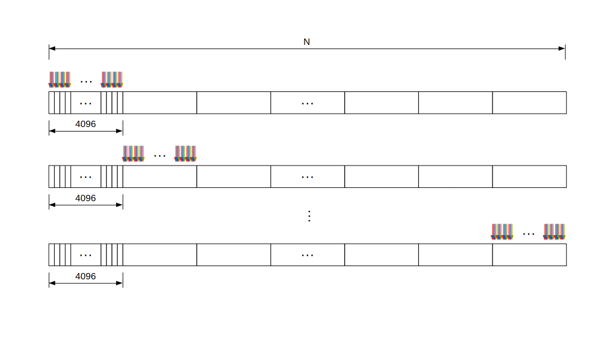

# Introduction

## Block

A block consists of many threads. In our case `block_dim==block_size==num_threads=256`.

The images of Block and Grid was taken from the Lei Mao blog
[CUDA Block and Grid](https://leimao.github.io/blog/CUDA-Concept-Block-Grid/)


In the above figure, each rectangle is a basic element in the array. When there is only one block, the parallel process could be imagined as **block_dim** pointers moving asynchronously. That is why you see the index are moving with a stride of block_dim in the following add function when there is only one block.

```
__global__
void add(int n, float *x, float *y)
{
  int index = threadIdx.x;
  int stride = blockDim.x;
  for (int i = index; i < n; i += stride)
      y[i] = x[i] + y[i];
}
```

## Grid

A Grid consists of many blocks. Each grid typically comprised of thousands to millions of lightweight GPU threads per kernel invocation. Here `grid_dim==grid_size=4096`.


Each small rectangle is a block in the grid. The parallel process could be imagined as `grid_dim_block_dim` pointers moving concurrently. The index are moving with a stride of `block_dim * gird_dim` in the `add` function

```
__global__
void add(int n, float *x, float *y)
{
  int index = blockIdx.x * blockDim.x + threadIdx.x;
  int stride = blockDim.x * gridDim.x;
  for (int i = index; i < n; i += stride)
    y[i] = x[i] + y[i];
}
```
