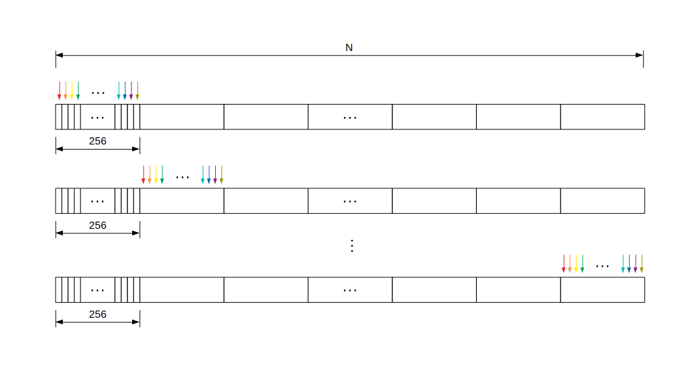

# Introduction

## Block

A block consists of many threads. In our case `block_dim==block_size==num_threads=256`.



In the above figure, each small rectangle is a basic element in the array. When there is only one block, the parallel process could be imagined as **block_dim** pointers moving asynchronously. That is why you see the index are moving with a stride of block_dim in the following add function when there is only one block.

```
__global__
void add(int n, float *x, float *y)
{
  int index = threadIdx.x;
  int stride = blockDim.x;
  for (int i = index; i < n; i += stride)
      y[i] = x[i] + y[i];
}
```
